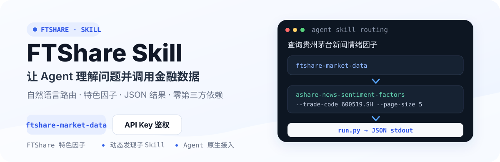

<p align="center">
  
</p>

<p align="center">
  <a href="README.md">中文</a> · <a href="README_EN.md">English</a>
</p>

<p align="center">
  
  
  
  <a href="https://github.com/FTShare-Lab/FTShare-skill/blob/main/LICENSE"></a>
</p>

<p align="center">
  <strong>让金融数据成为 AI 的可靠上下文。</strong><br>
  FTShare Skill 让 Agent 根据自然语言问题，自动选择并调用基础金融数据与 FTShare 特色因子接口。
</p>

<p align="center">
  <a href="https://ftai.chat/?tab=ft-share"><strong>FTShare 正式版</strong></a>
  · <a href="https://ftai.chat/me/profile">获取 API Key</a>
  · <a href="#三步开始使用">快速开始</a>
  · <a href="https://github.com/FTShare-Lab/FTShare-skill/issues">问题反馈</a>
</p>

> [!IMPORTANT]
> 本仓库提供一个可安装的父 Skill：`ftshare-market-data`。Agent 读取父 Skill 后，再从内部子 Skill 中选择对应数据接口，通过 `run.py` 执行请求并读取 JSON。所有请求都需要环境变量 `FTSHARE_API_KEY`。

## FTShare Skill 是什么

FTShare Skill 是 FTShare 面向 Agent 运行时提供的金融数据接入方式。将 `ftshare-market-data` 加载到 Claude Code、Codex、OpenClaw 等运行时后，用户可以直接用自然语言提出数据问题，由 Agent 完成接口选择、参数组织和结果读取。

<p align="center">
  <a href="https://ftai.chat/?tab=ft-share"></a>
</p>

<p align="center"><sub>FTShare 正式版公开页面。点击图片进入产品与套餐页面。</sub></p>

## 三步开始使用

### 1. 获取仓库

```bash
git clone https://github.com/FTShare-Lab/FTShare-skill.git
cd FTShare-skill
```

### 2. 配置 API Key

登录 [FTShare 账号中心](https://ftai.chat/me/profile) 获取 API Key，然后设置环境变量：

```bash
export FTSHARE_API_KEY="YOUR_FTSHARE_API_KEY"
```

请勿将真实 API Key 提交到 Git 仓库、Issue、日志或公开截图。

### 3. 加载父 Skill

将完整的 `ftshare-market-data` 目录放入 Agent 运行时的 Skill 目录。

| 运行时 | Skill 目录示例 |
|---|---|
| Claude Code 项目级 | `.claude/skills/ftshare-market-data/` |
| Claude Code 用户级 | `~/.claude/skills/ftshare-market-data/` |
| Codex 用户级 | `~/.codex/skills/ftshare-market-data/` |
| OpenClaw 等其他运行时 | 以对应运行时的 Skill 文档为准 |

目录中必须完整保留 `SKILL.md`、`run.py` 和 `sub-skills/`。

## 用特色因子完成第一次调用

加载后可以直接向 Agent 提问：

```text
使用 FTShare 查询贵州茅台 2026 年 8 月的新闻情绪因子
```

Agent 会路由到真实子 Skill：

```text
ashare-news-sentiment-factors
```

对应的真实命令为：

```bash
python3 ftshare-market-data/run.py ashare-news-sentiment-factors \
  --trade-code 600519.SH \
  --start-date 20260801 \
  --end-date 20260831 \
  --page 1 \
  --page-size 5
```

> [!NOTE]
> 该接口要求股票代码包含交易所后缀，例如 `600519.SH`。特色因子属于研究数据，具体可用范围取决于账号套餐，不构成股票推荐或未来收益判断。

## 路由是怎样工作的

```text
用户提出金融数据问题
    ↓
Agent 读取 ftshare-market-data/SKILL.md
    ↓
选择 sub-skills/<名称>/SKILL.md
    ↓
run.py 校验并执行 scripts/handler.py
    ↓
FTShare 数据服务返回 JSON
    ↓
Agent 整理并回答
```

查看当前可用路由：

```bash
python3 ftshare-market-data/run.py
```

## FTShare 的三种接入方式

| 接入方式 | 适合场景 | 调用形态 | 仓库 |
|---|---|---|---|
| **Python SDK** | Python 程序、数据分析、量化研究 | pandas `DataFrame`、Python rows、原始 JSON | [FTShare-python-sdk](https://github.com/FTShare-Lab/FTShare-python-sdk) |
| **MCP** | 支持 MCP 的 AI 客户端与 Agent | 标准 MCP 工具、结构化结果 | [FTShare-MCP](https://github.com/FTShare-Lab/FTShare-MCP) |
| **Skill** | Claude Code、Codex、OpenClaw 等 Agent 运行时 | 自然语言到数据接口的路由 | 当前仓库 |

三种方式连接同一套 FTShare 金融数据服务。需要在 Python 程序中稳定调用时使用 SDK；需要标准 MCP 工具时使用 MCP；需要 Agent 根据问题自动选择数据接口时使用 Skill。

## 数据能力

当前 Skill 覆盖现货、宏观经济、大模型语料、股票、美股、公募基金、ETF、港股、期货、债券和指数等数据域。

股票数据进一步包含资金流向、财务、参考、行情、打板专题、两融及转融通、特色数据和基础数据；特色数据包括 A 股新闻情绪因子、A 股相关性 Top-K、K 线形态标注、供应链关系和信号最新快照等。

最新接口、参数、字段、数据权限和更新状态，请查看：

**[FTShare 最新数据接口文档](https://market.ft.tech/gateway/doc/p/zdxwn9lx)**

仓库内每个子 Skill 的说明位于：

```text
ftshare-market-data/sub-skills/<子 Skill 名称>/SKILL.md
```

## 输出与错误

- 成功响应以格式化 JSON 输出到 stdout。
- HTTP、网络、认证和参数诊断输出到 stderr。
- 请求失败时使用非零退出状态。
- 分页和返回字段以对应子 Skill 的 `SKILL.md` 与最新官方文档为准。
- 缺少 `FTSHARE_API_KEY` 时，handler 不会发起网络请求。

## 安全约束

- `run.py` 只执行 `sub-skills/<名称>/scripts/handler.py` 形式的已发现子 Skill。
- handler 会校验请求协议和主机与当前 Base URL 一致。
- 默认 Base URL 为 `https://market.ft.tech/gateway`。
- 如需切换本地或内网环境，可使用 `FTSHARE_BASE_URL`；不要把内部服务地址写入公开文档。
- 下载类接口只允许输出到当前工作目录及其子目录。
- Skill 不应读取、记录或输出用户的 API Key。

## 项目结构

```text
FTShare-skill/
├── README.md
├── README_EN.md
└── ftshare-market-data/
    ├── SKILL.md
    ├── README.md
    ├── run.py
    ├── test_handlers_contract.py
    └── sub-skills/
        └── <子 Skill 名称>/
            ├── SKILL.md
            └── scripts/handler.py
```

## 参与贡献

欢迎提交新的金融数据子 Skill、接口适配、测试和文档改进。贡献前请阅读 [CONTRIBUTING.md](CONTRIBUTING.md)，安全问题请按照 [SECURITY.md](SECURITY.md) 反馈。

## 社区与反馈

- 使用问题与功能建议：[GitHub Issues](https://github.com/FTShare-Lab/FTShare-skill/issues)
- 正式产品与套餐：[FTShare](https://ftai.chat/?tab=ft-share)
- API Key 管理：[账号中心](https://ftai.chat/me/profile)
- Python SDK：[FTShare-python-sdk](https://github.com/FTShare-Lab/FTShare-python-sdk)
- MCP 接入：[FTShare-MCP](https://github.com/FTShare-Lab/FTShare-MCP)

### 加入 FTShare 社区交流群

欢迎加入 FTShare 社区交流群，讨论 Skill 接入、特色因子、金融数据接口和 Agent 使用。

<p align="center">
  
</p>

> 群内用于交流使用经验和补充问题信息；Bug、功能需求和 Skill 文档问题建议优先通过 GitHub Issues 提交。

**二维码有效期至 2026 年 9 月 9 日。** 如二维码失效，请在 Issues 中留言。

## License

本仓库代码与 Skill 实现采用 MIT License。开源许可证不自动包含 FTShare 托管数据服务的访问额度、数据授权、再分发权或商业数据使用权。

---

<p align="center"><strong>FTShare</strong> · 让金融数据成为 AI 的可靠上下文</p>
