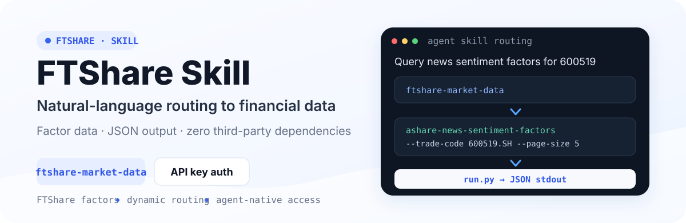

<p align="center">
  
</p>

<p align="center">
  <a href="README.md">中文</a> · <a href="README_EN.md">English</a>
</p>

<p align="center">
  
  
  
  <a href="https://github.com/FTShare-Lab/FTShare-skill/blob/main/LICENSE"></a>
</p>

<p align="center">
  <strong>Reliable financial context for AI.</strong><br>
  FTShare Skill lets an agent route natural-language questions to financial data and FTShare factor interfaces.
</p>

<p align="center">
  <a href="https://ftai.chat/?tab=ft-share"><strong>FTShare</strong></a>
  · <a href="https://ftai.chat/me/profile">Get an API key</a>
  · <a href="#get-started-in-three-steps">Get started</a>
  · <a href="https://github.com/FTShare-Lab/FTShare-skill/issues">Issues</a>
</p>

> [!IMPORTANT]
> This repository provides one installable parent Skill: `ftshare-market-data`. The agent reads the parent Skill, selects a matching data sub-skill, runs the request through `run.py`, and consumes JSON. Every request requires the `FTSHARE_API_KEY` environment variable.

## What is FTShare Skill?

FTShare Skill is FTShare's financial-data access method for agent runtimes. Load `ftshare-market-data` into Claude Code, Codex, OpenClaw, or another compatible runtime, then ask data questions in natural language. The agent handles interface selection, parameter construction, and result reading.

<p align="center">
  <a href="https://ftai.chat/?tab=ft-share"></a>
</p>

<p align="center"><sub>FTShare's public product page is currently in Chinese. Click the image to open it.</sub></p>

## Get started in three steps

### 1. Clone the repository

```bash
git clone https://github.com/FTShare-Lab/FTShare-skill.git
cd FTShare-skill
```

### 2. Configure the API key

Get an API key from the [FTShare account center](https://ftai.chat/me/profile), then set:

```bash
export FTSHARE_API_KEY="YOUR_FTSHARE_API_KEY"
```

Never commit a real API key to Git, issues, logs, or public screenshots.

### 3. Load the parent Skill

Place the complete `ftshare-market-data` directory in your runtime's Skill directory.

| Runtime | Example Skill directory |
|---|---|
| Claude Code project | `.claude/skills/ftshare-market-data/` |
| Claude Code user | `~/.claude/skills/ftshare-market-data/` |
| Codex user | `~/.codex/skills/ftshare-market-data/` |
| OpenClaw and other runtimes | Follow that runtime's Skill documentation |

Keep `SKILL.md`, `run.py`, and `sub-skills/` together.

## Make the first factor-data call

Ask the agent:

```text
Use FTShare to query news sentiment factors for Kweichow Moutai in August 2026.
```

The agent routes the request to this real sub-skill:

```text
ashare-news-sentiment-factors
```

The corresponding command is:

```bash
python3 ftshare-market-data/run.py ashare-news-sentiment-factors \
  --trade-code 600519.SH \
  --start-date 20260801 \
  --end-date 20260831 \
  --page 1 \
  --page-size 5
```

> [!NOTE]
> This interface requires an exchange suffix, such as `600519.SH`. Factor data may depend on plan entitlements and is research data, not an investment recommendation or prediction of future returns.

## How routing works

```text
User asks a financial-data question
    ↓
Agent reads ftshare-market-data/SKILL.md
    ↓
Selects sub-skills/<name>/SKILL.md
    ↓
run.py validates and executes scripts/handler.py
    ↓
FTShare returns JSON
    ↓
Agent organizes the answer
```

List currently available routes with:

```bash
python3 ftshare-market-data/run.py
```

## Three ways to use FTShare

| Access method | Best for | Interaction | Repository |
|---|---|---|---|
| **Python SDK** | Python apps, data analysis, quantitative research | pandas `DataFrame`, Python rows, raw JSON | [FTShare-python-sdk](https://github.com/FTShare-Lab/FTShare-python-sdk) |
| **MCP** | MCP-compatible AI clients and agents | Standard MCP tools and structured results | [FTShare-MCP](https://github.com/FTShare-Lab/FTShare-MCP) |
| **Skill** | Agent runtimes such as Claude Code, Codex, and OpenClaw | Natural-language routing to data interfaces | This repository |

All three connect to the same FTShare financial-data service. Use the SDK for direct Python programming, MCP for standard AI-client tools, and Skill when an agent should select interfaces from a natural-language request.

## Data coverage

The current Skill covers spot data, macroeconomics, LLM corpora, A-share data, US equities, public funds, ETFs, Hong Kong equities, futures, bonds, and indices.

The A-share section includes capital flows, financial statements, reference data, market data, limit-up topics, margin and securities lending, characteristic data, and basic data. Characteristic data includes A-share news sentiment factors, related-company Top-K, K-line pattern annotations, supply-chain relationships, and the latest signal snapshots.

For current interfaces, parameters, fields, entitlements, and update status, use:

**[Latest FTShare data documentation](https://market.ft.tech/gateway/doc/p/zdxwn9lx)**

Each repository sub-skill documents its own contract at:

```text
ftshare-market-data/sub-skills/<sub-skill-name>/SKILL.md
```

## Output and errors

- Successful responses are formatted JSON on stdout.
- HTTP, network, authentication, and parameter diagnostics go to stderr.
- Failed requests use a non-zero exit status.
- Pagination and fields follow the selected sub-skill's `SKILL.md` and the latest official documentation.
- A handler exits before making a request when `FTSHARE_API_KEY` is missing.

## Security constraints

- `run.py` only executes discovered `sub-skills/<name>/scripts/handler.py` entries.
- Handlers validate that request scheme and host match the configured Base URL.
- The default Base URL is `https://market.ft.tech/gateway`.
- Use `FTSHARE_BASE_URL` for local or internal environments; never publish internal service addresses.
- Download handlers only write inside the current working directory.
- A Skill must not read, log, or reveal a user's API key.

## Project structure

```text
FTShare-skill/
├── README.md
├── README_EN.md
└── ftshare-market-data/
    ├── SKILL.md
    ├── README.md
    ├── run.py
    ├── test_handlers_contract.py
    └── sub-skills/
        └── <sub-skill-name>/
            ├── SKILL.md
            └── scripts/handler.py
```

## Contributing

Contributions for new data sub-skills, interface adapters, tests, and documentation are welcome. Read [CONTRIBUTING.md](CONTRIBUTING.md) first, and report security issues through [SECURITY.md](SECURITY.md).

## Community and support

- Questions and feature requests: [GitHub Issues](https://github.com/FTShare-Lab/FTShare-skill/issues)
- Product and plans: [FTShare](https://ftai.chat/?tab=ft-share)
- API key management: [Account center](https://ftai.chat/me/profile)
- Python SDK: [FTShare-python-sdk](https://github.com/FTShare-Lab/FTShare-python-sdk)
- MCP: [FTShare-MCP](https://github.com/FTShare-Lab/FTShare-MCP)

### Join the FTShare community

<p align="center">
  
</p>

Use GitHub Issues for bugs, feature requests, and Skill documentation problems so they remain trackable. The QR code is valid through September 9, 2026.

## License

Code and Skill implementations in this repository use the MIT License. The license does not automatically grant hosted-service quota, data rights, redistribution rights, or commercial data usage rights.

---

<p align="center"><strong>FTShare</strong> · Reliable financial context for AI</p>
